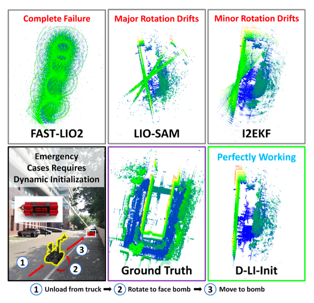
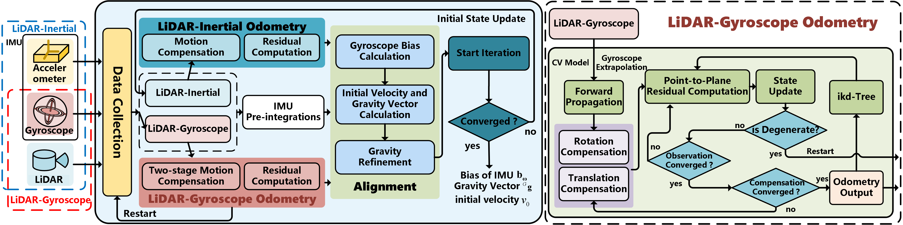

<div align="center">
  <h1>D-LI-Init</h1>
  <h2>Dynamic Initialization for LiDAR-inertial SLAM</h2>
  <p><strong>This work has been accepted to <i>IEEE/ASME Transactions on Mechatronics (TMECH 2025)</i>.</strong></p>
  <br>

  [](https://github.com/snakehaihai/D-LI-Init)
  [](https://arxiv.org/abs/2504.01451)
</div>


<p align="center">
  
  <br><em>Demonstration of real-world scenarios where the robot requires dynamic initialization, along with point cloud maps created using SOTA algorithms and ours.</em>
</p>
<p align="center">
  
  <br><em>System Overview: Robust Dynamic Initialization Pipeline</em>
</p>

## Abstract
The accuracy of the initial state, including initial velocity, gravity direction, and IMU biases, is critical for the initialization of LiDAR-inertial SLAM systems. Inaccurate initial values can reduce initialization speed or lead to failure. When the system faces urgent tasks, robust and fast initialization is required while the robot is moving, such as during the swift assessment of rescue environments after natural disasters, bomb disposal, and restarting LiDAR-inertial SLAM in rescue missions. However, existing initialization methods usually require the platform to remain stationary, which is ineffective when the robot is in motion. To address this issue, this paper introduces a robust and fast dynamic initialization method for LiDAR-inertial systems (D-LI-Init). This method iteratively aligns LiDAR-based odometry with IMU measurements to achieve system initialization. To enhance the reliability of the LiDAR odometry module, the LiDAR and gyroscope are tightly integrated within the ESIKF framework. The gyroscope compensates for rotational distortion in the point cloud. Translational distortion compensation occurs during the iterative update phase, resulting in the output of LiDAR-gyroscope odometry. The proposed method can initialize the system no matter the robot is moving or stationary. Experiments on public datasets and real-world environments demonstrate that the D-LI-Init algorithm can effectively serve various platforms, including vehicles, handheld devices, and UAVs. D-LI-Init completes dynamic initialization regardless of specific motion patterns.

**Contributors**: [Jie Xu](https://github.com/jiejie567), [Yongxin Ma](https://github.com/lian-yue0515), Yixuan Li, Xuanxuan Zhang, Jun Zhou, Shenghai Yuan, Lihua Xie 
### News
* **[23/03/2025]**: D_LI_Init is accepted to IEEE/ASME Transactions on Mechatronics.

## 1. Prerequisites
### 1.1 Ubuntu and ROS

Ubuntu >= 18.04.

ROS >= Melodic. [ROS](http://wiki.ros.org/ROS/Installation)

### 1.2 PCL && Eigen && gtsam

PCL >= 1.8, Follow [PCL](http://www.pointclouds.org/downloads/linux.html).

Eigen >= 3.3.4, Follow [EIGEN](http://eigen.tuxfamily.org/index.php?title=Main_Page).


### 1.3 livox_ros_driver

Follow [livox_ros_driver Installation](https://github.com/Livox-SDK/livox_ros_driver).


## 2. Build
Clone the repository and catkin_make:
```
cd ~/catkin_ws/src
git clone https://github.com/lian-yue0515/D-LI-Init.git
cd ..
catkin_make
```
## 3. Directly run
```
    # terminal 1: run D-LI-Init 
    cd ~/catkin_ws/src/D-LI-Init
    source devel/setup.bash
    roslaunch lidar_imu_init xxx.launch 

    # open the other terminal tab: run rosbag
    rosbag play xxx.bag
```
## 4. Rosbag Example
### 4.1 Public Dataset 
<!-- - M2DGR 
- NCLT
- utbm
- UrbanLoco
Download our test bags here: [Baidu](https://pan.baidu.com/s/1uKcH4jxbw3r6VGW6n_9SCQ?pwd=9nf5). -->
### 4.2 Real-world Field Dataset
<!-- - Indoor
- Outdoor 
Download our test bags here: Indoor [Baidu](https://pan.baidu.com/s/1wUiKRWQqie26cNfqIr7kYg?pwd=5gip), Outdoor [geogle](https://drive.google.com/drive/folders/1MWjbV5yU02uH5bu1YwsnymKqK1qrm4kI?usp=sharing). -->

### 5. Example results 


### 📖 Citation
If you use D-LI-Init for any academic work, please cite our original [paper]()
```
@article{xu2025dynamic,
  author       = {Jie Xu and Yongxin Ma and Yixuan Li and Xuanxuan Zhang and Jun Zhou and Shenghai Yuan and Lihua Xie},
  title        = {Dynamic Initialization for LiDAR-inertial SLAM},
  journal      = {IEEE/ASME Transactions on Mechatronics},
  year         = {2025}
}
```

### Acknowledgements 
- Thanks for [FAST_LIO](https://github.com/hku-mars/FAST_LIO).
- Thanks for [I2EKF](https://github.com/YWL0720/I2EKF-LO).

### License 
The source code is released under [GPLv2](http://www.gnu.org/licenses/) license.

### TODO(s)
* [ ] Example results updating
* [ ] Refinement and updating
* [ ] Waiting for comments on papers
